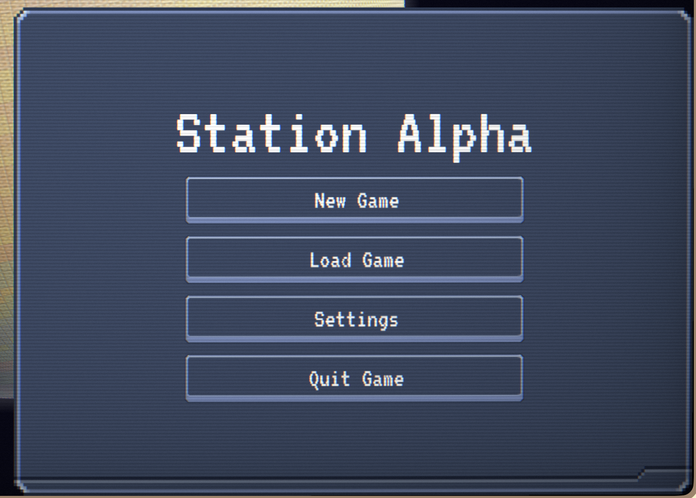

# FlexLöve

**A comprehensive UI library providing flexbox/grid layouts, theming, animations, and event handling for LÖVE2D games.**

FlexLöve is a flexible GUI library for Löve2D that implements a flexbox-based layout system.
The goals of this project are two-fold, first, to make a UI library that anyone with basic CSS knowledge can run with a minimal learning curve, and second, to have a single library take you from early prototyping to production easily and gradually.

## Features

- **Flexbox Layout**: Modern flexbox layouts for UI elements with full flex properties
- **Grid Layout**: CSS-like (but simplified) grid system for structured layouts
- **Element Management**: Hierarchical element structures with automatic sizing
- **Interactive Elements**: Buttons with click detection, event system, and callbacks
- **Theme System**: 9-patch (NinePatch) theming with state support (normal, hover, pressed, disabled)
- **Android 9-Patch Auto-Parsing**: Automatic parsing of *.9.png files with multi-region support
- **Animations**: Built-in animation support for transitions and effects
- **Image Support**: CSS-like object-fit, object-position, tiling/repeat modes, tinting, and opacity control
- **Responsive Design**: Automatic resizing with viewport units (vw, vh, %)
- **Color Handling**: Utility classes for managing colors in various formats
- **Text Rendering**: Flexible text display with alignment and auto-scaling
- **Corner Radius**: Rounded corners with individual corner control
- **Advanced Positioning**: Absolute, relative, flex, and grid positioning modes
- **(Warning - Alpha-stages - Not yet tested) Multi-Touch & Gestures**: Touch event tracking, gesture recognition (tap, double-tap, long-press, swipe, pan, pinch, rotate), and touch scrolling with momentum/bounce

## Quick Start

[Recommended] Go to the [releases](https://github.com/mikefreno/FlexLove/releases) page and download the latest release,
there are a few different options for different build profiles, I recommend the "default" build. Then add the `modules` directory and `FlexLove.lua` into your project.

Or, you can also install with luarocks:

```bash
luarocks install flexlove
```

Going this route, you will need to link the luarocks path to your project:
(for mac/linux)
```lua
package.path = package.path .. ";/Users/<username>/.luarocks/share/lua/<version>/?.lua"
package.path = package.path .. ";/Users/<username>/.luarocks/share/lua/<version>/?/init.lua"
package.cpath = package.cpath .. ";/Users/<username>/.luarocks/lib/lua/<version>/?.so"
```


```lua
local FlexLove = require("FlexLove")

function love.load()
  -- (Optional) Initialize with a theme and immediate mode
  FlexLove.init({
    theme = "space",
    immediateMode = true
  })
end

function love.update(dt)
  FlexLove.update(dt)
end

function love.draw()
    FlexLove.draw(function()
        -- Game content (will be blurred by backdrop blur)
        local button = FlexLove.new({
        width = "20vw",
        height = "10vh",
        backgroundColor = Color.new(0.2, 0.2, 0.8, 1),
        text = "Click Me",
        textSize = "md",
        themeComponent = "button",
        onEvent = function(element, event)
            print("Button clicked!")
    end
    })
    end, function()
        -- This is drawn AFTER all GUI elements - no backdrop blur
        SomeMetaComponent:draw()
    end)
end
```

## Quick Demos
All of the following use the [metal theme](./themes/metal.lua)


https://github.com/user-attachments/assets/39d958ce-f9e6-4ac6-9920-ac512f4612e9

https://github.com/user-attachments/assets/00984a74-c59b-4030-b6eb-65d08b9655e6

https://github.com/user-attachments/assets/922b38eb-a186-4a1a-b748-aa7815203f1a

https://github.com/user-attachments/assets/9840f61b-4f60-4f63-ab3b-912c7da7ad14

https://github.com/user-attachments/assets/388e0f59-8f93-420a-8b4c-efb9bccab251


## Build Profiles

FlexLöve supports optional modules to reduce bundle size for different use cases. Simply exclude module files you don't need - the library handles missing modules gracefully with null-object stubs.

### Available Profiles

- **Minimal (~60%)** - Core functionality only (layouts, basic elements, text)
- **Slim (~80%)** - Adds animations and image support
- **Default (~95%)** - Adds themes, blur effects, and gestures
- **Full (100%)** - Everything including performance monitoring

## Documentation

📚 **[View Full API Documentation](https://mikefreno.github.io/FlexLove/api.html)**

Complete API reference with all classes, methods, and properties is available on GitHub Pages. The documentation includes:

- Searchable sidebar navigation
- Syntax-highlighted code examples
- Version selector (access docs for previous versions)
- Detailed parameter and return value descriptions

### Documentation Versions

Access documentation for specific versions:
- **Latest:** [https://mikefreno.github.io/FlexLove/api.html](https://mikefreno.github.io/FlexLove/api.html)
- **Specific version:** `https://mikefreno.github.io/FlexLove/versions/v0.2.0/api.html`

## Core Concepts

### The Most Basic

There are no "prebuilt" components - there is just an `Element`. Think of it as everything
being a `<div>` in html. The `Element` can be anything you need - a container window, a button, an input field. It can also be combined to make more complex fields, like a sliders. The way to make these are just by setting the properties needed. `onEvent` can be used to make buttons, `editable` can be used to create input fields. You can check out the `examples/` to see complex utilization.

### Immediate Mode vs Retained Mode

FlexLöve supports both **immediate mode** and **retained mode** UI paradigms, giving you flexibility in how you structure your UI code:

#### Retained Mode (Default)
In retained mode, you create elements once and they persist across frames. The library manages the element hierarchy, but you must manage changes in element
state by .

```lua
local someGameState = true
-- Create elements once (e.g., in love.load)
local button1 = FlexLove.new({
  text = "Button 1",
  disabled = someGameState,
  onEvent = function() print("Clicked!") end
})
-- ... other things ... --
local someGameState = false  -- button1 will not change its disabled state, you need a way to update the element

local button2 = FlexLove.new({
  text = "Click to activate button 1",
  onEvent = function(_, event)
    if event.type == "release" then -- only fire on mouse release
      button1.disabled = false -- this will actual update the element
    end
  end
})
-- ... other things ... --
local someGameState = false  -- button1 will not change its disabled state, you need a way to update the element

local button2 = FlexLove.new({
  text = "Click to activate button 1",
  onEvent = function(_, event)
    if event.type == "release" then -- only fire on mouse release
      button1.disabled = false -- this will actual update the element
    end
  end
})

```

#### Immediate Mode
In immediate mode, you recreate UI elements every frame based on your application state. This approach can be simpler for dynamic UIs that change frequently.
There is of course some overhead for this, which is why it is not the default behavior.

```lua
-- Recreate UI every frame
local someGameState = true
-- Create elements once (e.g., in love.load)
local button1 = FlexLove.new({
  text = "Button 1",
  disabled = someGameState,
  onEvent = function() print("Clicked!") end
})
-- ... other things ... --
local someGameState = false  -- button1 in immediate mode will have its state updated 

local button2 = FlexLove.new({
  text = "Click to activate button 1",
  onEvent = function(_, event)
    if event.type == "release" then -- only fire on mouse release
      button1.disabled = false -- this will also update the element
    end
  end
})

```

You should be able to mix both modes in the same application - use retained mode for your main UI and immediate mode for debug overlays or dynamic elements,
though this hasn't been tested.

### Element Properties

Common properties for all elements:

```lua
{
  -- Positioning & Size
  x = 0,                    -- X position (number or string with units)
  y = 0,                    -- Y position
  width = 100,              -- Width (number, string, or "auto")
  height = 100,             -- Height
  z = 0,                    -- Z-index for layering
  
  -- Visual Styling
  backgroundColor = Color.new(0, 0, 0, 0),  -- Background color
  cornerRadius = 0,         -- Uniform radius or {topLeft, topRight, bottomLeft, bottomRight}
  border = {},              -- {top, right, bottom, left} boolean flags
  borderColor = Color.new(0, 0, 0, 1),
  opacity = 1,              -- 0 to 1
  
  -- Layout
  positioning = "flex",     -- "absolute", "relative", "flex", or "grid"
  padding = {},             -- {top, right, bottom, left} or shortcuts
  margin = {},              -- {top, right, bottom, left} or shortcuts
  gap = 10,                 -- Space between children
  
  -- Flexbox Properties
  flexDirection = "horizontal",  -- "horizontal" or "vertical"
  justifyContent = "flex-start", -- Main axis alignment
  alignItems = "stretch",        -- Cross axis alignment
  flexWrap = "nowrap",           -- "nowrap" or "wrap"
  
  -- Grid Properties
  gridRows = 1,
  gridColumns = 1,
  rowGap = 10,
  columnGap = 10,
  
  -- Text
  text = "Hello",
  textColor = Color.new(1, 1, 1, 1),
  textAlign = "start",      -- "start", "center", "end"
  textSize = "md",          -- Number or preset ("xs", "sm", "md", "lg", "xl", etc.)
  
  -- Images
  imagePath = "path/to/image.png",  -- Path to image file (auto-loads)
  image = imageObject,              -- Or provide love.Image directly
  objectFit = "fill",               -- "fill", "contain", "cover", "scale-down", "none"
  objectPosition = "center center", -- Image positioning (keywords or percentages)
  imageRepeat = "no-repeat",        -- "no-repeat", "repeat", "repeat-x", "repeat-y", "space", "round"
  imageTint = Color.new(1, 1, 1, 1), -- Color tint overlay (default: white/no tint)
  imageOpacity = 1,                 -- Image opacity 0-1 (combines with element opacity)
  
  -- Theming
  theme = "space",          -- Theme name
  themeComponent = "button", -- Component type from theme
  
  -- Interaction
  onEvent = function(element, event) end,
  disabled = false,
  disableHighlight = false, -- Disable pressed overlay (auto-true for themed elements)
  
  -- Hierarchy
  parent = nil,             -- Parent element
}
```

### Layout Modes

#### Absolute Positioning
```lua
local element = FlexLove.new({
  positioning = "absolute",
  x = 100,
  y = 50,
  width = 200,
  height = 100
})
```

#### Flexbox Layout
```lua
local container = FlexLove.new({
  positioning = "flex",
  flexDirection = "horizontal",
  justifyContent = "center",
  alignItems = "center",
  gap = 10
})
```

#### Grid Layout
```lua
local grid = FlexLove.new({
  positioning = "grid",
  gridRows = 3,
  gridColumns = 3,
  rowGap = 10,
  columnGap = 10
})
```

### Theme System
 
To create a theme explore themes/space.lua as a reference

Load and apply themes for consistent styling:

```lua
FlexLove.init({
  theme = "space" -- will use this as the initial theme
})

-- and if you need dynamic themes
local Theme = FlexLove.Theme
Theme.load("metal")
Theme.setActive("metal")

-- Use theme on elements
local button = Flexlove.new({
  width = 200,
  height = 60,
  text = "Themed Button",
  themeComponent = "button",  -- Uses "button" component from active theme
  backgroundColor = Color.new(0.5, 0.5, 1, 0.3)  -- Renders behind theme
})
```

#### Android 9-Patch Support

FlexLove automatically parses Android 9-patch (*.9.png) files:

```lua
-- Theme definition with auto-parsed 9-patch
{
  name = "My Theme",
  components = {
    button = {
      atlas = "themes/mytheme/button.9.png"
      -- insets automatically extracted from 9-patch borders
      -- supports multiple stretch regions for complex scaling
    },
    panel = {
      atlas = "themes/mytheme/panel.png",
      insets = { left = 20, top = 20, right = 20, bottom = 20 }
      -- manual insets still supported (overrides auto-parsing)
    }
  }
}
```

**9-Patch Format:**
- Files ending in `.9.png` are automatically detected and parsed
- **Guide pixels are automatically removed** - the 1px border is stripped during loading
- Top/left borders define stretchable regions (black pixels)
- Bottom/right borders define content padding (optional) - **automatically applied to child positioning**
- Supports multiple non-contiguous stretch regions
- Manual insets override auto-parsing when specified

**Scaling Corners:**
```lua
{
  button = {
    atlas = "themes/mytheme/button.9.png",
    scaleCorners = 2  -- Scale corners by 2x (number = direct multiplier)
  }
}
```
- `scaleCorners` accepts a number (e.g., 2 = 2x size, 0.5 = half size)
- Default: `nil` (no scaling, 1:1 pixel perfect)
- Corners scale uniformly while edges stretch as defined by guides

Themes support state-based rendering:
- `normal` - Default state
- `hover` - Mouse over element
- `pressed` - Element being clicked
- `disabled` - Element is disabled
- `active` - Element is active/focused

### Event System

Enhanced event handling with detailed event information:

```lua
onEvent = function(element, event)
  -- Mouse events:
  -- event.type: "click", "press", "release", "rightclick", "middleclick"
  -- event.button: 1 (left), 2 (right), 3 (middle)
  -- event.x, event.y: Mouse position
  -- event.clickCount: Number of clicks (for double-click detection)
  -- event.modifiers: { shift, ctrl, alt, gui }
  
  -- Touch events:
  -- event.type: "touchpress", "touchmove", "touchrelease", "touchcancel"
  -- event.touchId: Unique identifier for this touch
  -- event.pressure: Touch pressure (0.0-1.0)
  -- event.phase: "began", "moved", "ended", or "cancelled"
  
  if event.type == "click" and event.modifiers.shift then
    print("Shift-clicked!")
  elseif event.type == "touchpress" then
    print("Touch began at:", event.x, event.y)
  end
end
```

**Multi-Touch Support:**

FlexLöve provides comprehensive multi-touch event tracking and gesture recognition. See the [Multi-Touch Documentation](docs/MULTI_TOUCH.md) for:
- Touch event handling
- 7 gesture types (tap, double-tap, long-press, swipe, pan, pinch, rotate)
- Touch scrolling with momentum and bounce effects
- Complete API reference and examples

### Deferred Callbacks

Some LÖVE operations (like `love.window.setMode`) cannot be called while a Canvas is active. FlexLöve provides a deferred callback system to handle these operations safely:

```lua
-- In your event handler, queue the callback:
onEvent = function(element, event)
  if event.type == "click" then
    FlexLove.deferCallback(function()
      love.window.setMode(1920, 1080, { fullscreen = true })
    end)
  end
end

-- In your love.draw(), execute callbacks after ALL canvases are released:
function love.draw()
  love.graphics.setCanvas(myCanvas)
  FlexLove.draw()
  love.graphics.setCanvas() -- Release ALL canvases
  
  -- Execute deferred callbacks now that no canvas is active
  FlexLove.executeDeferredCallbacks()
end
```

**IMPORTANT:** You must call `FlexLove.executeDeferredCallbacks()` at the very end of your `love.draw()` function after releasing all canvases. This ensures callbacks execute in a safe context.

#### Automatic Deferral with `onEventDeferred`

Instead of manually wrapping callbacks with `FlexLove.deferCallback()`, you can set the `onEventDeferred` flag to automatically defer all callbacks for that handler:

```lua
FlexLove.Element.new({
  width = 200,
  height = 50,
  text = "Change Resolution",
  onEvent = function(element, event)
    if event.type == "click" then
      -- This will be automatically deferred!
      love.window.setMode(1920, 1080, { fullscreen = true })
    end
  end,
  onEventDeferred = true  -- Automatically defer all onEvent callbacks
})
```

This flag is available for all event callbacks:
- `onEventDeferred` - Defers `onEvent` callback
- `onFocusDeferred` - Defers `onFocus` callback
- `onBlurDeferred` - Defers `onBlur` callback
- `onTextInputDeferred` - Defers `onTextInput` callback
- `onTextChangeDeferred` - Defers `onTextChange` callback
- `onEnterDeferred` - Defers `onEnter` callback

Deferred callbacks are useful for:
- Changing window mode/resolution
- Loading resources that modify graphics state
- Any operation that conflicts with active canvas rendering

### Input Fields

FlexLöve provides text input support with single-line (and multi-line coming soon) fields:

```lua
-- Create a text input field
local input = FlexLove.new({
  x = 10,
  y = 10,
  width = 200,
  height = 30,
  editable = true,
  text = "Type here...",
  placeholder = "Enter text",
  textColor = Color.new(1, 1, 1, 1),
  onTextChange = function(element, newText, oldText)
    print("Text changed:", newText)
  end
})

local textArea = FlexLove.new({
  x = 10,
  y = 50,
  width = 300,
  height = 150,
  editable = true,
  multiline = true,
  text = "",
  placeholder = "Enter multiple lines..."
})
```

**Important**: To enable key repeat for navigation keys (arrows, backspace, delete), add this to your `love.load()`:

```lua
function love.load()
  love.keyboard.setKeyRepeat(true)
end
```

**Input Properties:**
- `editable` - Enable text input (default: false)
- `multiline` - Allow multiple lines (default: false)
- `placeholder` - Placeholder text when empty
- `maxLength` - Maximum character count
- `passwordMode` - Hide text with bullets
- `selectOnFocus` - Select all text when focused

**Input Callbacks:**
- `onTextChange(element, newText, oldText)` - Called when text changes
- `onTextInput(element, text)` - Called for each character input
- `onEnter(element)` - Called when Enter is pressed (single-line only)
- `onFocus(element)` - Called when input gains focus
- `onBlur(element)` - Called when input loses focus

**Features:**
- Cursor positioning and blinking
- Text selection (mouse and keyboard)
- Copy/Cut/Paste (Ctrl+C/X/V)
- Word navigation (Ctrl+Arrow keys)
- Select all (Ctrl+A)
- Automatic text scrolling to keep cursor visible
- UTF-8 support

### Responsive Units

Support for viewport-relative units:

```lua
local element = FlexLove.new({
  width = "50vw",   -- 50% of viewport width
  height = "30vh",  -- 30% of viewport height
  x = "25%",        -- 25% of parent width
  textSize = "3vh"  -- 3% of viewport height
})
```

#### Dynamic Calculations with calc()

Use `calc()` for CSS-like dynamic calculations in layout properties:

```lua
-- Center a button horizontally (accounting for its width)
local button = FlexLove.new({
  x = FlexLove.calc("50% - 10vw"),  -- Centers a 20vw wide button
  y = "50vh",
  width = "20vw",
  height = "10vh",
  text = "Centered Button"
})

-- Complex calculations with multiple operations
local sidebar = FlexLove.new({
  width = FlexLove.calc("100vw - 300px"),  -- Full width minus fixed sidebar
  height = FlexLove.calc("100vh - 50px"),  -- Full height minus header
  x = "300px",
  y = "50px"
})

-- Using parentheses for order of operations
local panel = FlexLove.new({
  width = FlexLove.calc("(100vw - 40px) / 3"),  -- Three equal columns with 40px total padding
  padding = { left = "10px", right = "10px" }
})
```

**Supported operations:** `+`, `-`, `*`, `/`  
**Supported units:** `px`, `%`, `vw`, `vh`, `ew`, `eh`  
**Note:** Element width/height units (`ew`, `eh`) cannot be used in position calculations (`x`, `y`) due to circular dependencies.

### Animations

Create smooth transitions:

```lua
local Animation = FlexLove.Animation

-- Fade animation
local fadeIn = Animation.fade(1.0, 0, 1)
fadeIn:apply(element)

-- Scale animation
local scaleUp = Animation.scale(0.5,
  { width = 100, height = 50 },
  { width = 200, height = 100 }
)
scaleUp:apply(element)

-- Custom animation with easing
local customAnim = Animation.new({
  duration = 1.0,
  start = { opacity = 0, width = 100 },
  final = { opacity = 1, width = 200 },
  easing = "easeInOutCubic"
})
customAnim:apply(element)
```

### Images

Display images with CSS-like object-fit and positioning:

```lua
local Gui = FlexLove.Gui

-- Basic image display
local imageBox = Gui.new({
  width = 200,
  height = 200,
  imagePath = "assets/photo.jpg",
  objectFit = "cover",          -- fill, contain, cover, scale-down, none
  objectPosition = "center center", -- positioning within bounds
  imageOpacity = 1.0,
  imageTint = Color.new(1, 1, 1, 1), -- optional color tint
})
```

**Object-fit modes:**
- `fill` - Stretch to fill (may distort)
- `contain` - Fit within bounds (preserves aspect ratio)
- `cover` - Cover bounds (preserves aspect ratio, may crop)
- `scale-down` - Use smaller of none or contain
- `none` - Natural size (no scaling)

**Object-position examples:**
- `"center center"` - Center both axes
- `"top left"` - Top-left corner
- `"bottom right"` - Bottom-right corner
- `"50% 20%"` - Custom percentage positioning

**Image tiling:**
```lua
{
  imagePath = "pattern.png",
  imageRepeat = "repeat",  -- repeat, repeat-x, repeat-y, no-repeat, space, round
}
```

**Image effects:**
```lua
{
  imageTint = Color.new(1, 0, 0, 1),  -- Red tint overlay
  imageOpacity = 0.8,                   -- 80% opacity
}
```

See `examples/image_showcase.lua` for a comprehensive demonstration of all image features.

### Creating Colors

```lua
local Color = FlexLove.Color
-- From RGB values (0-1 range)
local red = Color.new(1, 0, 0, 1)

-- From hex string
local blue = Color.fromHex("#0000FF")
local semiTransparent = Color.fromHex("#FF000080")
```

## API Reference

### Flexlove (Main Module)

- `Flexlove.init(props)` - Initialize GUI system with base scale
- `Flexlove.new(props)` - Create a new element
- `Flexlove.update(dt)` - Update all elements
- `Flexlove.draw()` - Draw all elements
- `Flexlove.resize()` - Handle window resize

### Color

- `Color.new(r, g, b, a)` - Create color (values 0-1)
- `Color.fromHex(hex)` - Create from hex string
- `Color:toHex()` - Convert to hex string
- `Color:toRGBA()` - Get RGBA values

### Theme (only needed for dynamic changes)

- `Theme.load(name)` - Load theme by name
- `Theme.setActive(name)` - Set active theme
- `Theme.getActive()` - Get current active theme

### Animation

- `Animation.new(props)` - Create custom animation
- `Animation.fade(duration, from, to)` - Fade animation
- `Animation.scale(duration, from, to)` - Scale animation

## Examples

The `examples/` directory contains comprehensive demos:

- `EventSystemDemo.lua` - Event handling and callbacks
- `CornerRadiusDemo.lua` - Rounded corners showcase
- `ThemeLayeringDemo.lua` - Theme system with layering
- `DisableHighlightDemo.lua` - Highlight control
- `SimpleGrid.lua` - Grid layout examples
- `TextSizePresets.lua` - Text sizing options
- `OnClickAnimations.lua` - Animation examples
- `ZIndexDemo.lua` - Layering demonstration
- `touch_demo.lua` - Interactive multi-touch and gesture demo
- `image_showcase.lua` - Image display and manipulation features

## Testing

Run tests with:
```bash
lua testing/runAll.lua
# or a specific test:
lua testing/__tests__/<specific_test>
```

## Compatibility


**Compatibility:**
- **Lua**: 5.1+
- **LÖVE**: 11.x (tested)
- **LuaJIT**: Compatible

## License

MIT License - see LICENSE file for details.

## Contributing

This library is under active development. Contributions, bug reports, and feature requests are welcome!
