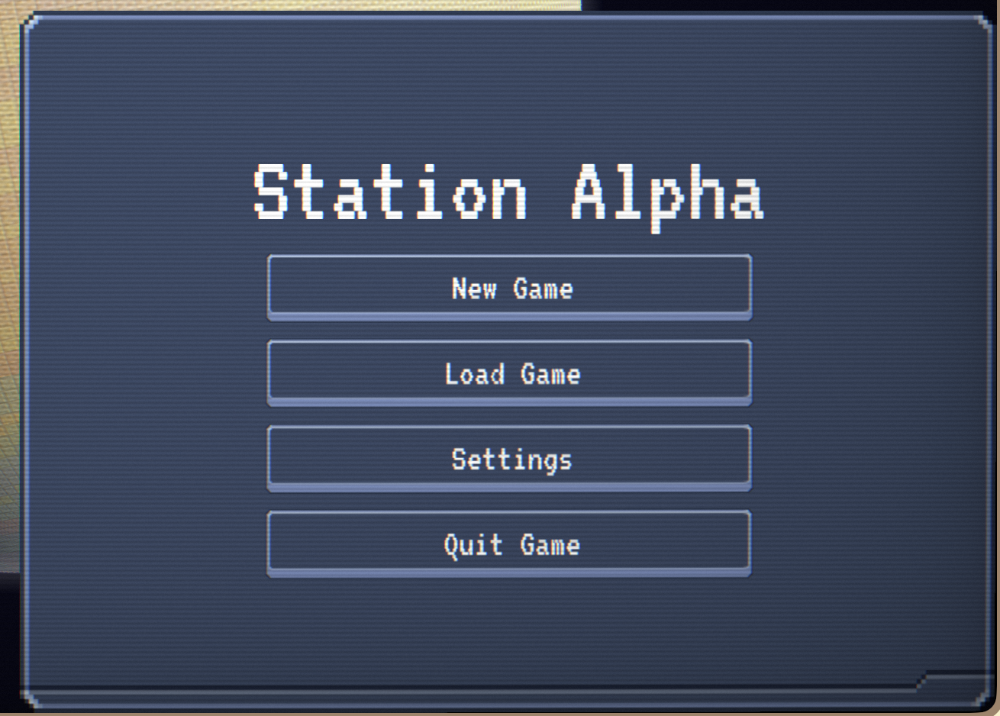

# FlexLöve

**A comprehensive UI library providing flexbox/grid layouts, theming, animations, and event handling for LÖVE2D games.**

<p align="center">
  <strong><a href="https://mikefreno.github.io/FlexLove/">Documentation</a> • <a href="#quick-start">Quick Start</a> • <a href="https://github.com/mikefreno/FlexLove/releases">Releases</a> • <a href="https://mikefreno.github.io/FlexLove/examples.html">Examples</a> • <a href="https://mikefreno.github.io/FlexLove/api.html">API Reference</a></strong>
</p>

Built for developers who know CSS and want that same power (and more) in their game UIs. FlexLöve brings CSS-familiar flexbox and grid layouts to Löve2D, supporting both rapid prototyping (immediate mode) and production-optimized (retained mode) rendering. Whether you're sketching ideas or shipping products, FlexLöve adapts to your workflow—essentially no learning curve required if you've touched CSS.

## Features

**Layout**

- **Flexbox & Grid**: CSS-familiar flexbox and grid layouts with full property support
- **Advanced Positioning**: Absolute, relative, flex, and grid positioning modes
- **Responsive Units**: Viewport-relative units (vw, vh, %), calc(), and auto-sizing
- **Corner Radius**: Rounded corners with individual corner control

**Rendering**

- **Theme System**: 9-patch (NinePatch) theming with state support (normal, hover, pressed, disabled)
- **Android 9-Patch Auto-Parsing**: Automatic parsing of *.9.png files with multi-region support
- **Animations**: Built-in animation with easing curves, keyframes, and sequencing
- **Image Support**: CSS-like object-fit, object-position, tiling/repeat, tinting, and opacity
- **Text Rendering**: Flexible text display with alignment, wrapping, and auto-scaling
- **Blur Effects**: Backdrop blur for glassmorphic UI effects

**Interaction**

- **Event System**: Click, press, hover, release with modifier key detection
- **Keyboard Navigation**: Tab/Shift+Tab sequential focus and arrow key directional navigation
- **Input Fields**: Text input with cursor, selection, clipboard, and UTF-8 support
- **Multi-Touch & Gestures** *(Alpha - not yet tested)*: Touch tracking, gesture recognition (tap, double-tap, long-press, swipe, pan, pinch, rotate), touch scrolling with momentum/bounce

**Developer Experience**

- **Debug Overlay**: Element boundary visualization for layout debugging
- **Immediate & Retained Modes**: Choose per-project between declarative and persistent UI
- **Build Profiles**: Optional modules let you trim bundle size for different use cases

## Keyboard Navigation

FlexLöve provides opt-in keyboard navigation — Tab/Shift+Tab sequential focus, arrow key directional navigation (spatial awareness), Enter/Space activation, and Escape dismissal.

```lua
FlexLove.init({
  theme = "space",
  keyboardNavigation = true  -- Auto-initializes everything
})
```

Or enable later with `FlexLove.enableKeyboardNavigation({...})`.

| Key | Action |
|-----|--------|
| `Tab` | Move focus to next focusable element |
| `Shift + Tab` | Move focus to previous focusable element |
| `Arrow Keys` | Directional (spatial) navigation |
| `Enter` / `Space` | Activate focused element |
| `Escape` | Dismiss/close focused element |
| `F12` | Toggle developer tools |

Elements are automatically focusable if they have `editable = true`, an `onEvent` handler, or a `themeComponent`. Customize behavior at runtime via the `KeyboardNavigation` and `FocusIndicator` modules:

```lua
local KeyboardNavigation = require("modules.KeyboardNavigation")
local FocusIndicator = require("modules.FocusIndicator")

KeyboardNavigation.setDirectionalNavigation(true)
KeyboardNavigation.setWrapAround(true)
KeyboardNavigation.setKeyBinding("next", "f1")
KeyboardNavigation.enableSpatialIndex(true)  -- Recommended for >50 focusable elements

FocusIndicator.setColor(0.2, 0.6, 1.0, 0.8)
FocusIndicator.setLineWidth(2)
FocusIndicator.setPulseEnabled(true)
```

Navigation containers (`Context.setNavigationContainer`) scope focus to modals/dialogs; focus stack (`pushFocus`/`popFocus`) preserves focus across modals. Type annotations for ARIA roles (`ariaRole`, `ariaLabel`, `ariaDescribedBy`) are defined in the type system; runtime support is pending.

## Quick Start

[Recommended] Go to the [releases](https://github.com/mikefreno/FlexLove/releases) page and download the latest release,
there are a few different options for different build profiles, I recommend the "default" build. Then add the `modules` directory and `FlexLove.lua` into your project.

Or, you can also install with luarocks:

```bash
luarocks install flexlove
```

Going this route, you will need to link the luarocks path to your project:
(for mac/linux)

```lua
package.path = package.path .. ";/Users/<username>/.luarocks/share/lua/<version>/?.lua"
package.path = package.path .. ";/Users/<username>/.luarocks/share/lua/<version>/?/init.lua"
package.cpath = package.cpath .. ";/Users/<username>/.luarocks/lib/lua/<version>/?.so"
```

```lua
local FlexLove = require("FlexLove")

function love.load()
  -- (Optional) Initialize with a theme and immediate mode
  FlexLove.init({
    theme = "space",
    immediateMode = true
  })
end

function love.update(dt)
  FlexLove.update(dt)
end

function love.draw()
  FlexLove.draw()
end
```

## Quick Demos

All of the following use the [metal theme](./themes/metal.lua)


<https://github.com/user-attachments/assets/39d958ce-f9e6-4ac6-9920-ac512f4612e9>

<https://github.com/user-attachments/assets/00984a74-c59b-4030-b6eb-65d08b9655e6>

<https://github.com/user-attachments/assets/922b38eb-a186-4a1a-b748-aa7815203f1a>

<https://github.com/user-attachments/assets/9840f61b-4f60-4f63-ab3b-912c7da7ad14>

<https://github.com/user-attachments/assets/388e0f59-8f93-420a-8b4c-efb9bccab251>


## Build Profiles

FlexLöve supports optional modules to reduce bundle size for different use cases. The library handles missing modules gracefully with null-object stubs. See [Build Profiles](docs/BUILD_PROFILES.md) for the full module matrix, or use the prebuilt profile packages from the [releases page](https://github.com/mikefreno/FlexLove/releases).

### Available Profiles

- **Minimal (~78%)** - Core functionality only (layouts, basic elements, text)
- **Slim (~88%)** - Adds animations, image support, keyboard nav and focus
- **Default (~96%)** - Adds themes, blur effects, and gestures
- **Full (100%)** - Everything including performance monitoring

## Documentation

📚 **[View Full API Documentation](https://mikefreno.github.io/FlexLove/api.html)**

Complete API reference with all classes, methods, and properties is available on GitHub Pages. The documentation includes:

- Searchable sidebar navigation
- Syntax-highlighted code examples
- Version selector (access docs for previous versions)
- Detailed parameter and return value descriptions

### Documentation Versions

Access documentation for specific versions:

- **Latest:** [https://mikefreno.github.io/FlexLove/api.html](https://mikefreno.github.io/FlexLove/api.html)
- **Specific version:** `https://mikefreno.github.io/FlexLove/versions/v0.2.0/api.html`

## Core Concepts

### The Most Basic

There are no "prebuilt" components - there is just an `Element`. Think of it as everything
being a `<div>` in html. The `Element` can be anything you need - a container window, a button, an input field. It can also be combined to make more complex fields, like a sliders. The way to make these are just by setting the properties needed. `onEvent` can be used to make buttons, `editable` can be used to create input fields. You can check out the `examples/` to see complex utilization.

### Immediate Mode vs Retained Mode

FlexLöve supports both **immediate mode** and **retained mode** UI paradigms, giving you flexibility in how you structure your UI code:

#### Retained Mode (Default)

In retained mode, create elements once and they persist across frames. Update element properties directly in response to events.

```lua
local button1 = FlexLove.new({
  text = "Button 1",
  disabled = true,
  onEvent = function() print("Clicked!") end
})

-- Update element state in event handlers
local button2 = FlexLove.new({
  text = "Click to activate button 1",
  onEvent = function(_, event)
    if event.type == "release" then
      button1.disabled = false
    end
  end
})
```

#### Immediate Mode

In immediate mode, recreate UI elements every frame inside `FlexLove.draw()`. State is read fresh each frame:

```lua
function love.draw()
  FlexLove.draw(function()
    local button = FlexLove.new({
      text = "Button 1",
      disabled = someGameState,
      onEvent = function() print("Clicked!") end
    })
  end)
end
```

### Layout Modes

#### Absolute Positioning

```lua
local element = FlexLove.new({
  positioning = "absolute",
  x = 100,
  y = 50,
  width = 200,
  height = 100
})
```

#### Flexbox Layout

```lua
local container = FlexLove.new({
  positioning = "flex",
  flexDirection = "horizontal",
  justifyContent = "center",
  alignItems = "center",
  gap = 10
})
```

#### Grid Layout

Uniform grid (all cells equal size):

```lua
local grid = FlexLove.new({
  positioning = "grid",
  gridRows = 3,
  gridColumns = 3,
  rowGap = 10,
  columnGap = 10
})
```

Variable column widths / row heights with `gridColumns` / `gridRows`:

```lua
local grid = FlexLove.new({
  positioning = "grid",
  gridColumns = { "1fr", "2fr", "100px" },  -- 3 cols: flexible, 2x flexible, fixed
  gridRows = { "auto", "200px", "1fr" },    -- 3 rows: auto-sized, fixed, flexible
  rowGap = 10,
  columnGap = 10
})
```

`gridColumns` and `gridRows` accept either a **number** (equal `1fr` tracks) or an **array** of track specs. For example, `gridColumns = 3` gives three equal-width columns, while `gridColumns = {"1fr", "2fr", "100px"}` gives explicit track sizing with track count inferred from the array length.

Track size units:

- **`px` / number** — Fixed pixel size (`100`, `"100px"`, `200`)
- **`%`** — Percentage of available container space (`"25%"`)
- **`fr`** — Fractional unit: distributes remaining space proportionally (`"1fr"`, `"2fr"`, `"3fr"`)
- **`auto`** — Sizes to content: uses child's explicit dimension or calculated content size; if multiple children occupy the same track, takes the maximum. When no `fr` tracks exist, `auto` tracks grow equally to fill remaining space (matches CSS Grid)

When `gridColumns` / `gridRows` are arrays, track count is inferred from the array length. When they are numbers or nil, the layout falls back to equal `1fr` tracks.

### Theme System

To create a theme explore themes/space.lua as a reference

Load and apply themes for consistent styling:

```lua
FlexLove.init({
  theme = "space" -- will use this as the initial theme
})

-- and if you need dynamic themes
local Theme = FlexLove.Theme
Theme.load("metal")
Theme.setActive("metal")

-- Use theme on elements
local button = FlexLove.new({
  width = 200,
  height = 60,
  text = "Themed Button",
  themeComponent = "button",  -- Uses "button" component from active theme
  backgroundColor = Color.new(0.5, 0.5, 1, 0.3)  -- Renders behind theme
})
```

#### 9-Patch Support

FlexLove automatically parses Android-style 9-patch (*.9.png) files:

```lua
-- Theme definition with auto-parsed 9-patch
{
  name = "My Theme",
  components = {
    button = {
      atlas = "themes/mytheme/button.9.png"
      -- insets automatically extracted from 9-patch borders
      -- supports multiple stretch regions for complex scaling
    },
    panel = {
      atlas = "themes/mytheme/panel.png",
      insets = { left = 20, top = 20, right = 20, bottom = 20 }
      -- manual insets still supported (overrides auto-parsing)
    }
  }
}
```

**9-Patch Format:**

- Files ending in `.9.png` are automatically detected and parsed
- **Guide pixels are automatically removed** - the 1px border is stripped during loading
- Top/left borders define stretchable regions (black pixels)
- Bottom/right borders define content padding (optional) - **automatically applied to child positioning**
- Supports multiple non-contiguous stretch regions
- Manual insets override auto-parsing when specified

**Scaling Corners:**

```lua
{
  button = {
    atlas = "themes/mytheme/button.9.png",
    scaleCorners = 2  -- Scale corners by 2x (number = direct multiplier)
  }
}
```

- `scaleCorners` accepts a number (e.g., 2 = 2x size, 0.5 = half size)
- Default: `nil` (no scaling, 1:1 pixel perfect)
- Corners scale uniformly while edges stretch as defined by guides

Themes support state-based rendering:

- `normal` - Default state
- `hover` - Mouse over element
- `pressed` - Element being clicked
- `disabled` - Element is disabled
- `active` - Element is active/focused

### Event System

Enhanced event handling with detailed event information:

```lua
onEvent = function(element, event)
  -- Mouse events:
  -- event.type: "click", "press", "release", "rightclick", "middleclick"
  -- event.button: 1 (left), 2 (right), 3 (middle)
  -- event.x, event.y: Mouse position
  -- event.clickCount: Number of clicks (for double-click detection)
  -- event.modifiers: { shift, ctrl, alt, gui }
  
  -- Touch events:
  -- event.type: "touchpress", "touchmove", "touchrelease", "touchcancel"
  -- event.touchId: Unique identifier for this touch
  -- event.pressure: Touch pressure (0.0-1.0)
  -- event.phase: "began", "moved", "ended", or "cancelled"
  
  if event.type == "click" and event.modifiers.shift then
    print("Shift-clicked!")
  elseif event.type == "touchpress" then
    print("Touch began at:", event.x, event.y)
  end
end
```

**Multi-Touch Support:**

FlexLöve provides multi-touch event tracking and gesture recognition with built-in gesture types:

- Touch event handling (`touchpress`, `touchmove`, `touchrelease`, `touchcancel`)
- 7 gesture types (tap, double-tap, long-press, swipe, pan, pinch, rotate)
- Touch scrolling with momentum and bounce effects
- **Requires `touchEnabled = true`** on elements to receive touch events

### Text Rendering

Elements display text via the `text` property. Control appearance with standard properties:

```lua
local label = FlexLove.new({
  text = "Hello World",
  textColor = Color.new(1, 1, 1, 1),
  textSize = "1.5vw",           -- Font size (px, vw, vh, or named like "md")
  font = "path/to/font.ttf",    -- Custom font (optional)
  textAlign = "center",         -- "left", "center", "right"
  textWrap = true,              -- Enable word wrapping
  lineHeight = 1.5,             -- Line spacing multiplier
})
```

### Custom Rendering

Each element supports a `customDraw` callback function that executes after the element's standard rendering but before visual feedback. This is useful for:

- Adding custom graphics on top of elements
- Creating complex visual effects
- Utilize flex love positioning to place whatever you need

```lua
local panel = FlexLove.new({
    width = 300,
    height = 200,
    backgroundColor = Color.new(0.1, 0.1, 0.1, 1),
    customDraw = function(element)
        -- Draw a custom border around the element
        love.graphics.setLineWidth(3)
        love.graphics.setColor(1, 1, 0, 1)  -- Yellow
        love.graphics.rectangle("line",
            element.x - 5,
            element.y - 5,
            element.width + 10,
            element.height + 10
        )

        -- Draw a cross in the center
        love.graphics.setColor(1, 0, 0, 1)  -- Red
        local cx = element.x + element.width / 2
        local cy = element.y + element.height / 2
        love.graphics.line(cx - 20, cy, cx + 20, cy)
        love.graphics.line(cx, cy - 20, cx, cy + 20)
    end
})
```

**Note:** The custom draw context is pushed with a fresh graphics state, so it won't affect parent elements or subsequent rendering.

### Debug View

Enable the debug draw overlay to visualize element boundaries, hit areas, and layout structure during development. This helps identify:

- Element positioning and sizing
- Overlapping elements
- Hidden or transparent elements
- Layout flow issues

**Enable via initialization:**

```lua
FlexLove.init({
    debugDraw = true,           -- Always enable debug overlay
    debugDrawKey = "F3"         -- Press F3 to toggle (optional)
})
```

**Programmatic control:**

```lua
-- Toggle debug view at runtime
FlexLove.setDebugDraw(true)    -- Enable
FlexLove.setDebugDraw(false)   -- Disable

-- Check if debug view is active
local isEnabled = FlexLove.getDebugDraw()
```

**Features:**

- Each element displays with a unique random color
- Full opacity border (1px) and 0.5 opacity fill
- Renders regardless of element visibility or opacity
- Press `F3` (or your configured key) to toggle on/off
- Essential for debugging click targets and layout issues

### Deferred Callbacks

LÖVE operations like `love.window.setMode()` crash while a Canvas is active. Set `onEventDeferred = true` to defer callbacks until after all canvases are released:

```lua
FlexLove.new({
  text = "Change Resolution",
  onEvent = function(el, event)
    love.window.setMode(1920, 1080, { fullscreen = true })
  end,
  onEventDeferred = true
})
```

Call `FlexLove.executeDeferredCallbacks()` at the very end of `love.draw()` after releasing all canvases. Also available: `onFocusDeferred`, `onBlurDeferred`, `onTextInputDeferred`, `onTextChangeDeferred`, `onEnterDeferred`.

### Input Fields

FlexLöve provides text input support with single-line (and multi-line coming soon) fields:

```lua
-- Create a text input field
local input = FlexLove.new({
  x = 10,
  y = 10,
  width = 200,
  height = 30,
  editable = true,
  text = "Type here...",
  placeholder = "Enter text",
  textColor = Color.new(1, 1, 1, 1),
  onTextChange = function(element, newText, oldText)
    print("Text changed:", newText)
  end
})

local textArea = FlexLove.new({
  x = 10,
  y = 50,
  width = 300,
  height = 150,
  editable = true,
  multiline = true,
  text = "",
  placeholder = "Enter multiple lines..."
})
```

**Important**: To enable key repeat for navigation keys (arrows, backspace, delete), add this to your `love.load()`:

```lua
function love.load()
  love.keyboard.setKeyRepeat(true)
end
```

**Input Properties:**

- `editable` - Enable text input (default: false)
- `multiline` - Allow multiple lines (default: false)
- `placeholder` - Placeholder text when empty
- `maxLength` - Maximum character count
- `passwordMode` - Hide text with bullets
- `selectOnFocus` - Select all text when focused

**Input Callbacks:**

- `onTextChange(element, newText, oldText)` - Called when text changes
- `onTextInput(element, text)` - Called for each character input
- `onEnter(element)` - Called when Enter is pressed (single-line only)
- `onFocus(element)` - Called when input gains focus
- `onBlur(element)` - Called when input loses focus

**Features:**

- Cursor positioning and blinking
- Text selection (mouse and keyboard)
- Copy/Cut/Paste (Ctrl+C/X/V)
- Word navigation (Ctrl+Arrow keys)
- Select all (Ctrl+A)
- Automatic text scrolling to keep cursor visible
- UTF-8 support

### Responsive Units

Support for viewport-relative units:

```lua
local element = FlexLove.new({
  width = "50vw",   -- 50% of viewport width
  height = "30vh",  -- 30% of viewport height
  x = "25%",        -- 25% of parent width
  textSize = "3vh"  -- 3% of viewport height
})
```

#### Dynamic Calculations with calc()

Use `calc()` for CSS-like dynamic calculations in layout properties:

```lua
-- Center a button horizontally (accounting for its width)
local button = FlexLove.new({
  x = FlexLove.calc("50% - 10vw"),  -- Centers a 20vw wide button
  y = "50vh",
  width = "20vw",
  height = "10vh",
  text = "Centered Button"
})

-- Complex calculations with multiple operations
local sidebar = FlexLove.new({
  width = FlexLove.calc("100vw - 300px"),  -- Full width minus fixed sidebar
  height = FlexLove.calc("100vh - 50px"),  -- Full height minus header
  x = "300px",
  y = "50px"
})

-- Using parentheses for order of operations
local panel = FlexLove.new({
  width = FlexLove.calc("(100vw - 40px) / 3"),  -- Three equal columns with 40px total padding
  padding = { left = "10px", right = "10px" }
})
```

**Supported operations:** `+`, `-`, `*`, `/`  
**Supported units:** `px`, `%`, `vw`, `vh`

### Animations

Create smooth transitions:

```lua
local Animation = FlexLove.Animation

-- Fade animation
local fadeIn = Animation.fade(1.0, 0, 1)
fadeIn:apply(element)

-- Scale animation
local scaleUp = Animation.scale(0.5,
  { width = 100, height = 50 },
  { width = 200, height = 100 }
)
scaleUp:apply(element)

-- Custom animation with easing
local customAnim = Animation.new({
  duration = 1.0,
  start = { opacity = 0, width = 100 },
  final = { opacity = 1, width = 200 },
  easing = "easeInOutCubic"
})
customAnim:apply(element)
```

### Images

Display images with CSS-like object-fit and positioning:

```lua
local imageBox = FlexLove.new({
  width = 200,
  height = 200,
  imagePath = "assets/photo.jpg",
  objectFit = "cover",          -- fill, contain, cover, scale-down, none
  objectPosition = "center center", -- positioning within bounds
  imageOpacity = 1.0,
  imageTint = Color.new(1, 1, 1, 1), -- optional color tint
})
```

**Object-fit modes:**

- `fill` - Stretch to fill (may distort)
- `contain` - Fit within bounds (preserves aspect ratio)
- `cover` - Cover bounds (preserves aspect ratio, may crop)
- `scale-down` - Use smaller of none or contain
- `none` - Natural size (no scaling)

**Object-position examples:**

- `"center center"` - Center both axes
- `"top left"` - Top-left corner
- `"bottom right"` - Bottom-right corner
- `"50% 20%"` - Custom percentage positioning

**Image tiling:**

```lua
{
  imagePath = "pattern.png",
  imageRepeat = "repeat",  -- repeat, repeat-x, repeat-y, no-repeat, space, round
}
```

**Image effects:**

```lua
{
  imageTint = Color.new(1, 0, 0, 1),  -- Red tint overlay
  imageOpacity = 0.8,                   -- 80% opacity
}
```

See `examples/image_showcase.lua` for a comprehensive demonstration of all image features.

### Creating Colors

```lua
local Color = FlexLove.Color
-- From RGB values (0-1 range)
local red = Color.new(1, 0, 0, 1)

-- From hex string
local blue = Color.fromHex("#0000FF")
local semiTransparent = Color.fromHex("#FF000080")
```

## API Reference

### FlexLove (Main Module)

- `FlexLove.init(props)` - Initialize with theme, mode, and config
- `FlexLove.new(props)` - Create a new element
- `FlexLove.update(dt)` - Update all elements
- `FlexLove.draw(gameDrawFunc?, postDrawFunc?)` - Draw all elements
- `FlexLove.resize()` - Handle window resize
- `FlexLove.calc(expr)` - Create a calc expression for dynamic layouts
- `FlexLove.deferCallback(fn)` - Queue callback to run after canvas release
- `FlexLove.executeDeferredCallbacks()` - Run deferred callbacks
- `FlexLove.enableKeyboardNavigation(config?)` - Enable keyboard nav at runtime
- `FlexLove.setDebugDraw(enabled)` - Toggle debug overlay
- `FlexLove.getElementAtPosition(x, y)` - Hit-test UI elements
- `FlexLove.getById(id)` - Find element by ID
- `FlexLove.setMode(mode)` - Switch immediate/retained mode

### Color

- `Color.new(r, g, b, a)` - Create color (values 0-1)
- `Color.fromHex(hex)` - Create from hex string
- `Color:toRGBA()` - Get RGBA values

### Theme (only needed for dynamic changes)

- `Theme.load(name)` - Load theme by name
- `Theme.setActive(name)` - Set active theme
- `Theme.getActive()` - Get current active theme

### Animation

- `Animation.new(props)` - Create custom animation
- `Animation.fade(duration, fromOpacity, toOpacity, easing?)` - Fade animation
- `Animation.scale(duration, fromScale, toScale, easing?)` - Scale animation

## Changelog

### Removed

- **Per-element mode override**: The `mode` property (`"immediate"` / `"retained"`) on individual elements has been removed. Mode is now purely global — set once via `FlexLove.init({ immediateMode = true })`.
- **FFI module**: The FFI optimization module has been removed. All layout and rendering computations now use pure Lua.
- **`ew`/`eh` units**: Element-relative width/height units have been removed. Use `vw`, `vh`, `%`, or `px` instead.

## Compatibility

**Compatibility:**

- **Lua**: 5.1+
- **LÖVE**: 11.x (tested)
- **LuaJIT**: Compatible

## License

MIT License - see LICENSE file for details.

## Contributing

This library is under active development(when I have time for it). Contributions, bug reports, and feature requests are welcome!
